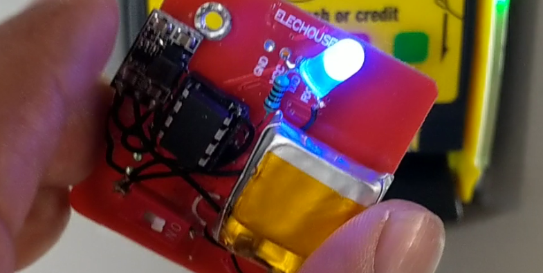
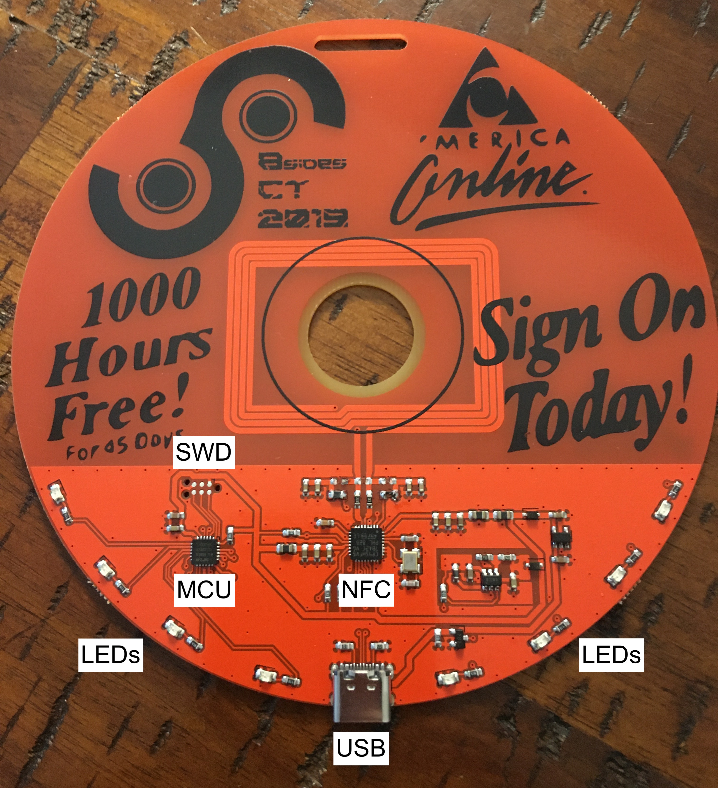
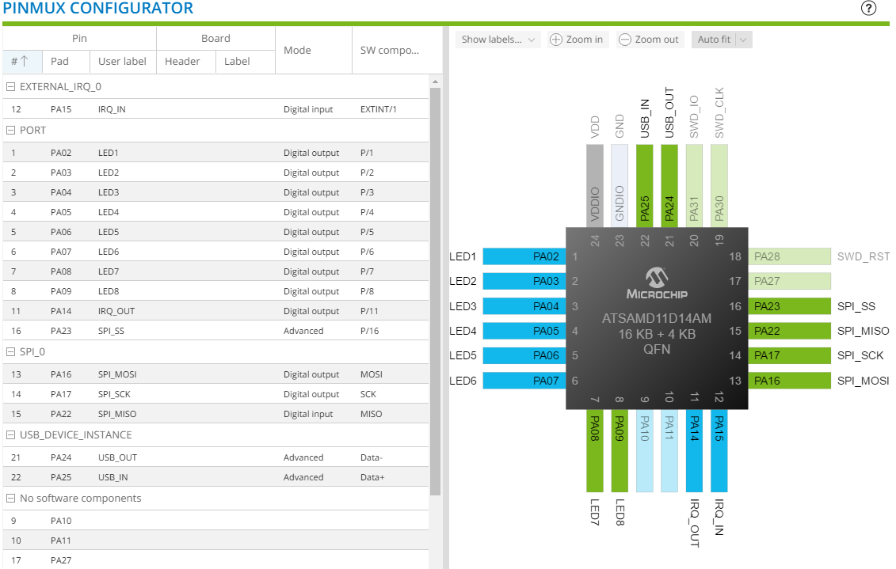
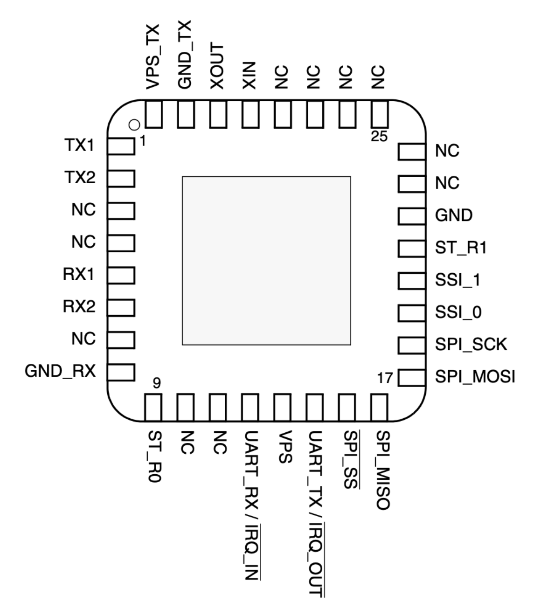
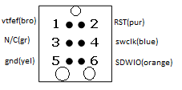
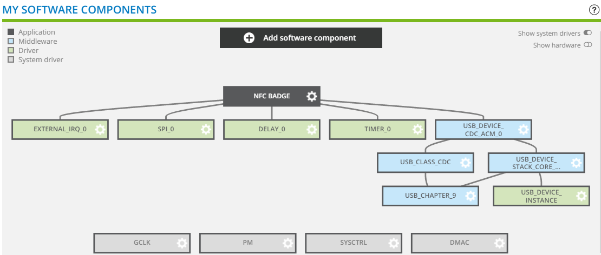
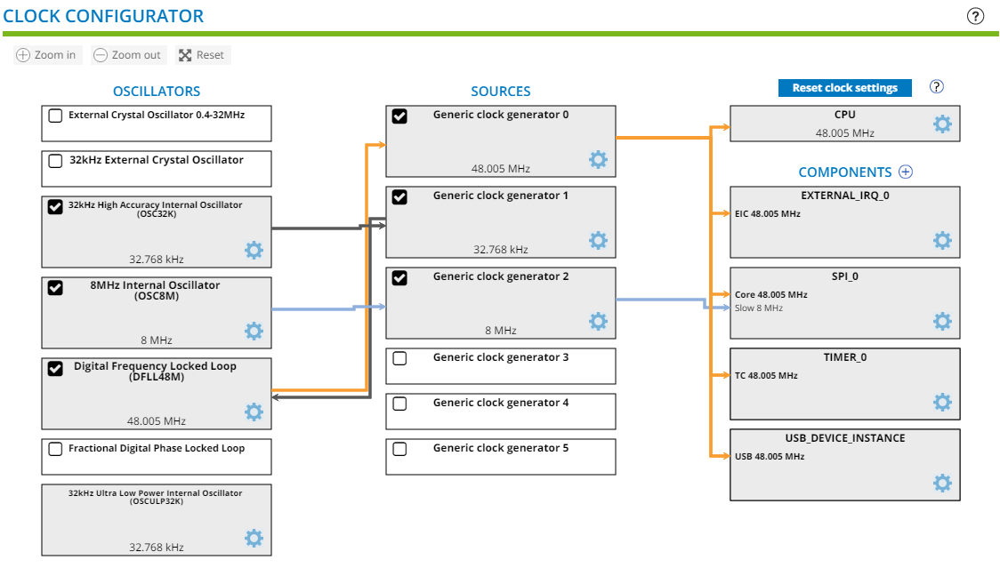
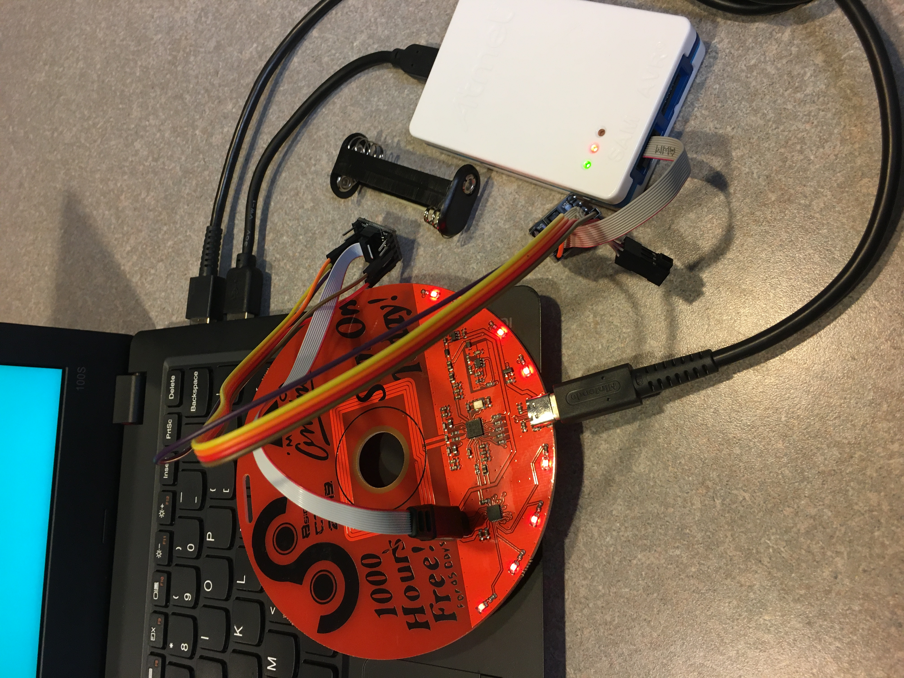

# 2020-Badge
Source code, schematics, and advice for hacking the 2020 BSidesCT electronic badge.

## TL;DR

- Software to blink the LEDs on the badge is functional, and you can get it here: [Software/LEDBlink](https://github.com/BSides-CT/2020-Badge/tree/main/Software/LEDBlink)
- Software to use the NFC reader on the badge is not functional, and you can get it here: [Software/NFCBadge](https://github.com/BSides-CT/2020-Badge/tree/main/Software/NFCBadge)
- Read on for more information about what works, what doesn't, and what challenges you are likely to encounter while hacking the badge.

## The Long and Sad Tale of the BSidesCT ~~2019~~ 2020 Badge

### Part 1: Prologue

It started in 2019 when we had a great idea to make a badge with an NFC card reader built into it. We were inspired by the [NFCopy85](https://salmg.net/2019/06/16/nfcopy85/) project and wanted to do something like it. After all, how cool would it be to use your BSidesCT badge to replay hotel key cards, smart locks, or credit card transactions?!

We designed the badge, ordered the PCBs, and started working on the software. We thought we gave sufficient lead time for the boards to be cut and shipped from China...but alas, they arrived to late to be distributed at last year's conference (hence the swell DIY badges we ~~threw together at the last possible second~~ ended up with).

As it turns out, we were doomed to failure last year – even if the badges had arrived on time, we could not have anticipated the other problems we had yet to discover....

### Part 2: Down the Rabbit Hole

The PCBs and other parts finally arrived after BSidesCT 2019 had come and gone, but we found solace in the idea that we could finish them for distribution in 2020. Unfortunately for us, a couple of things made that effort significantly harder:

1. The badge's original designer ghosted us, leaving the 2020 team without design schematics.
2. No working software had yet been produced.

Undeterred, we set out to crack this nut, or at the very least make some LEDs blink. It was pretty obvious from examining the board and components that it had been designed with three main features:

- Cortex-based microcontroller
- NFC chip
- USB-C port

There were also six contact pads arranged in a way that looked like Serial Wire Debug (SWD/JTAG), which should provide a way to program the microcontroller.

From there, we started examining traces, mapping pins, testing connectivity, and generally trying to figure out What Stuff Does™. After many interations and improvements, we finally identified the exact components and pinouts in use. Without further ado, here they are.

#### Microcontroller: Atmel SAM D11 D14AM

- [Datasheet summary](https://github.com/BSides-CT/2020-Badge/blob/main/Hardware/Atmel-SAM-D11-Summary.pdf)
- [Datasheet](https://github.com/BSides-CT/2020-Badge/blob/main/Hardware/Atmel-SAM-D11-Datasheet.pdf)
- Pinout:
  

#### NFC: CR95HF

- [Datasheet](https://github.com/BSides-CT/2020-Badge/blob/main/Hardware/CR95HF-Datasheet.pdf)
- Pinout:
  

We did not identify any additional storage components, so the 16 KB of flash storage available on the SAMD11 was all we would have to work with.

In order to program the badge, we acquired a [J-Link EDU Mini](https://www.segger.com/products/debug-probes/j-link/models/j-link-edu-mini/) (later replaced with an [Atmel ICE](https://www.microchip.com/DevelopmentTools/ProductDetails/atatmel-ice)) and relied on our trusty multimeter to map the SWD pinout on the PCB:

We soldered on some wires, plugged them into the J-Link, and fired up [Atmel Studio](https://www.microchip.com/mplab/avr-support/atmel-studio-7) to write some code.

### Part 3: Progress at Last!

Thanks to Atmel Start, it was pretty simple at that point to load up some basic drivers for the SAMD11AM, identify which pins had LEDs attached to them, and write some basic code to make them blink. The J-Link worked like a charm for this simple task.

We added in some functions to make the LEDs blink in fun patterns and decided that, if nothing else, at least we could ship the badges with [that simple program](https://github.com/BSides-CT/2020-Badge/tree/main/Software/LEDBlink). Feel free to customize it to blink however you want it to!

### Part 4: Straight into a Wall

Having enjoyed a fleeting moment of accomplishment, we got back to work on trying to figure out how to get the other components working. The initial goals were pretty simple:

1. Have the CR95HF scan until it found an NFC tag it recognized.
2. Output feedback while scanning to a serial terminal over USB.

Fortunately, Atmel Start also makes it pretty simple to support these features. From the traces on the PCB, we were able to determine that the MCU was intended to communicate with the CR95HF via SPI and not UART, so we knew we would need SPI drivers. We also learned that in order to have the USB port be recognized by another device (i.e. a computer) as a serial terminal (virtual COM port), we would need to configure it as a CDC device.

We configured Atmel Start with the appropriate drivers, mapped the pins appropriately, and then spent a lot of time fussing with the clock configurations (and datasheets) to get everything playing nicely. In the end, this is what our driver stack and clock configs looked like:

The project compiled successfully with the USB drivers, and when we plugged the badge into a computer, it showed up as a COM port in the Device Manager (hooray!). Unfortunately, this is where our luck began to run out. We tried to get the badge to print simple text messages to serial output over USB, but no matter how we attempted to connect to the virtual terminal (or at what baud rate), no messages were ever displayed. We did some troubleshooting and were able to determine that the USB drivers initiated successfully and the serial write function completed successfully, so we were mystified about where communication broke down.

### Part 5: Left Hanging

Not longer after this development, we finally managed to get in touch with the original designer, who sent us the [KiCad design schematics](https://github.com/BSides-CT/2020-Badge/tree/main/Hardware/Schematics) and non-functioning prototype software. This information confirmed many of the determinations we had made, corrected several of our mistakes, and gave us a jump on the software to use to run the CR95HF. Unfortunately, despite being able to integrate much of that code into our own project, we quickly ran into a deal-breaker as the CR95HF failed to initialize. Without serial output, of course, we found this exceedingly hard to debug, and mostly relied on the LEDs to test whether specific functions succeeded or failed.

In the end, we ran out of time and decided it would be best to deliver the badges with some nice blinking lights and a link to a GitHub repo with all the information one needs to pick up where we left off. There is a still a great deal of potential in this project for those who are more knowledgable than our scrappy band of misfits!

Our hope is that someone will solve one or two of the problems that held us up and find a way to make the badge do something more interesting than just blink its LEDs! If that person is you, please reach out to us at info@bsidesct.org and we'll be excited to trade notes.

### Epilogue: Known Issues

Along the way, we discovered several problems that stopped us from reaching our initial goal. Here they are, for the reader's edification:

- We were unable to get USB working as a functional virtual com port. The designer suspected there might have been a design or manufacturing flaw involved, but this year's team did not have enough electrical engineering knowledge to verify this. You can power the badge via USB.

- We were unable to get the CR95HF to initalize successfully. The initialization sequence involves a loop that continually tests for a response from the chip before moving on, but it never escapes that loop.

- While testing basic components, we started to run out of storage space. If you manage to get the NFC chip functional, it is likely you will need to get creative about managing data to make the badge do anything interesting.

- Programming the badges en masse proved to be a challenge, as the SWD pin pads do not map to any standard configuration. As such, we had to build our own adapter to remap the standard 10-pin cable from our Atmel ICE programmer to a standard 6-pin TC2030 programming cable.

  

  We don't recommend doing it this way, which was only really necessary for mass production – you're better off just soldering wires onto the badge to program it. Follow the SWD pinout we posted above, and you should be good to go!

